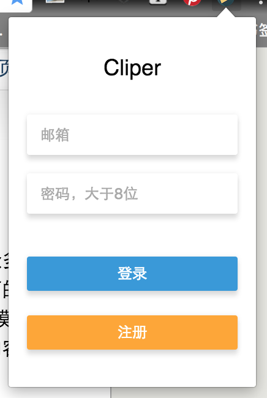
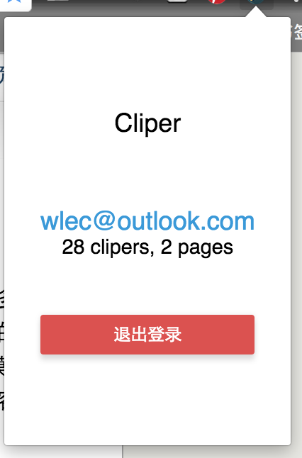
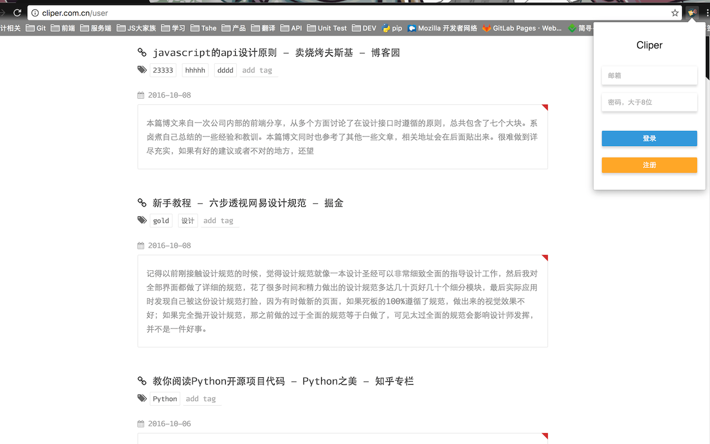

A chrome extension to clip paragraph or page in website. you can download at [cliper chrome extension](https://chrome.google.com/webstore/detail/biijehenaabpogldekblkfgooifmagbi)

## Screen shoots







## Try in local

- clone & build

```bash
$ git clone https://github.com/ecmadao/cliper-chrome.git
$ cd cliper-chrome
$ npm i
$ npm run build
```

- locate your chrome to chrome://extensions/
- open "developer mode"
- click "load unpacked", then load "build" folder in this repository

## Download

[](https://chrome.google.com/webstore/detail/biijehenaabpogldekblkfgooifmagbi)

You can download released version in [chrome extension store](https://chrome.google.com/webstore/detail/biijehenaabpogldekblkfgooifmagbi)

## Author

[ecmadao](https://github.com/ecmadao)

## License

Apache License 2.0
